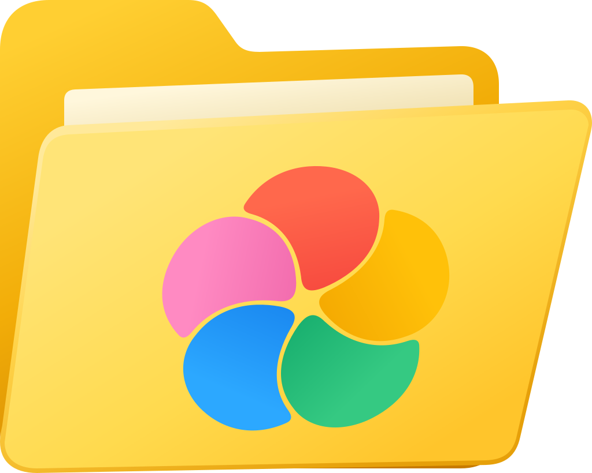

<p align="center">
  
</p>

# Immich Folder Watch

[](./docs/installation-windows.md)
[-FCC624?logo=linux&logoColor=black)](./packaging/flatpak/README.md)
[](./LICENSE)

`Immich Folder Watch` is a desktop app for **Windows and Linux** that watches local folders and uploads newly created media to Immich automatically.

It runs as a per-user desktop app — no system service, no elevation on every change. If screenshots, camera imports, scanner output, or synced files land on a desktop before they land in Immich, this fills that gap without writing directly into Immich storage.

---

## Use Cases

- Automatically upload screenshots into an Immich album
- Watch a DSLR or SD-card import folder and send new photos to Immich
- Ingest scanner output into a family archive
- Pick up files dropped by another tool into a staging folder
- Run a small always-on system that feeds Immich in the background
- Separate sources by album, for example `Screenshots`, `Camera Imports`, or `Receipts`
- Same configuration shape and feature set on Windows and Linux


---

## Solution

`immich-folder-watch` watches one or more folders, waits until files are fully written, and uploads them through the normal Immich HTTP API.

That gives you a clean, low-maintenance ingestion path:

- Desktop GUI with background operation; the Windows build includes a tray icon,
  while the first Flathub build shows an in-app banner until a Flatpak-safe tray
  backend is available
- Per-user operation — each user runs their own configuration
- Autostart on login (toggleable in the GUI; uses the Background portal on Linux)
- Optional per-folder album placement in Immich
- API-based uploads instead of storage hacks

Each watched folder has its own **sync mode**: upload only new files that appear during runtime (the default, preserving prior behavior), upload everything the folder already contains, or keep the folder bidirectionally in sync with its Immich album (additive — local files missing in the album are uploaded and album assets missing locally are downloaded). Deletions are never mirrored — the app does not remove files locally or remotely, and it does not write directly into Immich's storage folders.

---

## Features

- Watches one or more local folders for new media files
- Waits until files are stable before upload
- Uploads through the Immich API in configurable batches
- Supports optional per-source `albumName`
- Creates missing albums automatically when album placement is configured
- Per-folder **sync mode**: `Upload new files only` (default), `Upload everything in the folder`, or `Sync folder with album (bidirectional)`
- Persistent sync state shared by all watched folders, so unchanged files do not generate uploads or downloads after a restart
- Retries transient upload failures automatically
- Runs as a per-user desktop app with live sync status
- Autostarts on login by default; togglable in the GUI
- Verifies Immich URL, API key, and required permissions from the GUI
- Localized UI (English, German) with OS auto-detect and live in-app language switching
- Cross-platform: Windows MSI and Linux Flatpak built from the same Core; Windows logs to the Event Log by default, Linux to journald

---

## Installation

### Windows (MSI)

1. Download the latest MSI from [GitHub Releases](https://github.com/VoltKraft/immich-folder-watch/releases).
2. Install it with administrative rights (per-machine binary install).
3. Open the `Immich Folder Watch` desktop shortcut.
4. Enter your Immich URL and API key and review the verification result.
5. Select one or more folders and expand **Advanced Watch Options** only when you want to adjust subdirectories, extensions, or exclude filters.
6. **Save and Apply** — watching starts in-process.

Each Windows user has their own configuration. The app autostarts at login by default.

Installed layout:

- Binaries: `%ProgramFiles%\Immich Folder Watch\bin\` (shared, per-machine)
- Config: `%LOCALAPPDATA%\Immich Folder Watch\config.yaml` (per user)
- Sync state: `%LOCALAPPDATA%\Immich Folder Watch\sync-state.db` (one shared database per user)
- Logs: Windows Event Log (`Immich Folder Watch` source, default) or `%LOCALAPPDATA%\Immich Folder Watch\logs\` when File logging is selected
- Autostart: `%APPDATA%\Microsoft\Windows\Start Menu\Programs\Startup\Immich Folder Watch.lnk`

Upgrading from an older service-based install: the legacy service is stopped and removed, and the existing `C:\ProgramData\Immich Folder Watch\config.yaml` is migrated into the installing user's `%LOCALAPPDATA%`.

### Linux (Flatpak)

The Flathub listing is in submission. Once it's live, installation will be a single command:

```bash
flatpak install flathub io.github.voltkraft.immich-folder-watch
```

Until then, build and install the Flatpak from source per [`packaging/flatpak/README.md`](./packaging/flatpak/README.md):

```bash
./tools/generate-nuget-sources.sh
flatpak-builder --user --install --force-clean \
    packaging/flatpak/build-dir \
    packaging/flatpak/flathub/io.github.voltkraft.immich-folder-watch.yml
flatpak run io.github.voltkraft.immich-folder-watch
```

The Flatpak package runs through X11/XWayland because the current Avalonia
Linux backend initializes X11. The current Flathub build disables Avalonia's
StatusNotifierItem tray backend because it requires a broad KDE D-Bus own-name
permission that Flathub no longer grants to new apps; the app shows a window
banner and can be reopened from the launcher or Background Apps.

Sandbox layout:

- App ID: `io.github.voltkraft.immich-folder-watch`
- Config: `~/.var/app/io.github.voltkraft.immich-folder-watch/config/immich-folder-watch/config.yaml`
- Sync state: `~/.var/app/io.github.voltkraft.immich-folder-watch/config/immich-folder-watch/sync-state.db`
- Logs: journald (default — `journalctl --user -t io.github.voltkraft.immich-folder-watch.desktop`) or `~/.var/app/io.github.voltkraft.immich-folder-watch/data/Immich Folder Watch/logs/` when File logging is selected
- Autostart: managed via the desktop's Background portal — toggle inside the GUI

Folder picking goes through the FreeDesktop FileChooser portal so the app only sees the folders you explicitly grant. The watcher resolves the doc-portal handles back to host paths via `org.freedesktop.portal.Documents`, and inotify-blind FUSE mounts are covered by a 5-second polling sweep.

The app keeps one automatically managed `sync-state.db` beside `config.yaml` for
all watched folders. On the first start after this database is introduced, it
performs a mode-appropriate reconciliation and records confirmed transfers.
Later starts reconcile file metadata in the background; files whose size and UTC
modification time are unchanged are not hashed, uploaded, or downloaded.

Detailed guides:

- [Windows Installation](./docs/installation-windows.md)
- [Linux Flatpak packaging](./packaging/flatpak/README.md)
- [Configuration](./docs/configuration.md)
- [Troubleshooting](./docs/troubleshooting.md)

---

## Example

Example configuration:

```yaml
immich:
  serverApiUrl: "https://immich.example.com/api"
  apiKey: "REPLACE_WITH_IMMICH_API_KEY"

watch:
  sources:
    - path: "C:\\Users\\YOUR_USER\\Pictures\\Screenshots"
      albumName: "Screenshots"
      syncMode: "uploadNew" # uploadNew (default) | uploadAll | sync
      deleteAfterUpload: false # upload modes only; permanently deletes verified local uploads
      includeSubdirectories: true
      extensions:
        - ".avif"
        - ".bmp"
        - ".gif"
        - ".heic"
        - ".heif"
        - ".jp2"
        - ".jpe"
        - ".jpeg"
        - ".jpg"
        - ".insp"
        - ".jxl"
        - ".png"
        - ".psd"
        - ".raw"
        - ".rw2"
        - ".svg"
        - ".tif"
        - ".tiff"
        - ".webp"
      excludeDirectories:
        - "private"
      excludeFileNames:
        - "Thumbs.db"
  batchIntervalSeconds: 5
  maxBatchSize: 25
  fileReadyTimeoutSeconds: 30

retry:
  maxAttempts: 5
  baseDelayMilliseconds: 500

logging:
  level: "Information"
  logDirectory: "C:\\Users\\YOUR_USER\\AppData\\Local\\Immich Folder Watch\\logs"
```

---

## Documentation

The GUI keeps per-source watch options collapsed by default and only shows `Excluded Directories` when `Include subdirectories` is enabled.

Upload-only sources can optionally act as an inbox by permanently deleting local files after Immich confirms the upload and album assignment. The option is disabled by default and never applies to bidirectional `sync` sources.

- [Configuration](./docs/configuration.md)
- [Windows Installation](./docs/installation-windows.md)
- [Linux Flatpak packaging](./packaging/flatpak/README.md)
- [Architecture](./docs/architecture.md)
- [Troubleshooting](./docs/troubleshooting.md)
- [Development](./docs/development.md)

---

## Contact

Issues and feature requests are welcome via GitHub Issues.
Please read [`CONTRIBUTING.md`](./CONTRIBUTING.md) first.

---

## ⭐ Support the Project

If you find the project useful, consider leaving a star on GitHub ⭐
It helps visibility and supports continued development.

---

## ⭐ Star History

<a href="https://www.star-history.com/#/VoltKraft/immich-folder-watch&type=date&legend=top-left">
 <picture>
   <source media="(prefers-color-scheme: dark)" srcset="https://api.star-history.com/image?repos=voltkraft/immich-folder-watch&type=date&theme=dark&legend=top-left" />
   <source media="(prefers-color-scheme: light)" srcset="https://api.star-history.com/image?repos=voltkraft/immich-folder-watch&type=date&legend=top-left" />
   
 </picture>
</a>

---

## License

This repository is licensed under **AGPL-3.0-only**. See [LICENSE](./LICENSE).
