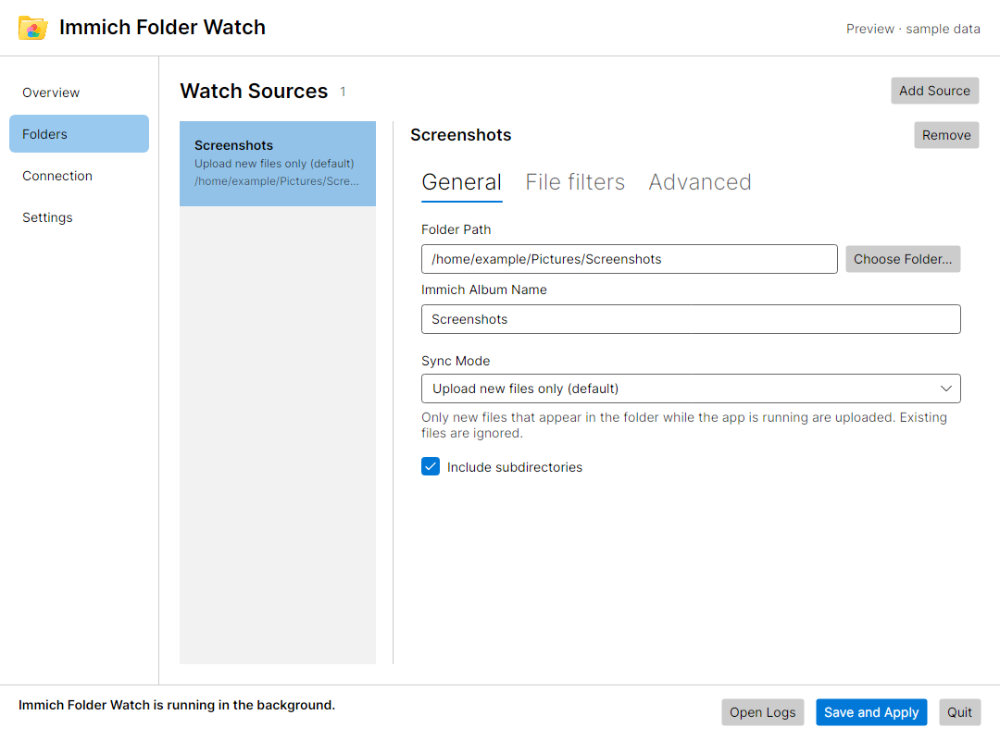
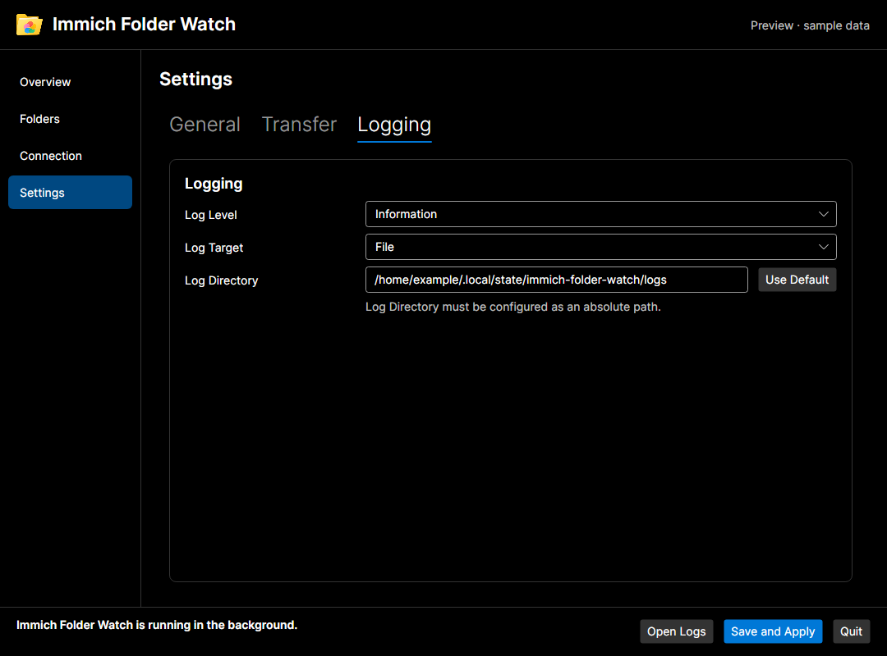

# Linux desktop feature parity

The Linux host implements the Windows desktop capabilities through the same
Core, Immich integration, and shared view model. Desktop permission and packaging
differences remain intentional. This matrix records the implementation and its
automated verification; it does not substitute headless tests for native desktop
acceptance.

| Capability | Implementation and verification |
| --- | --- |
| Upload new, upload all, bidirectional sync, albums, filters, deletion, transfer order, batching and retry | Both hosts register the same worker, API clients, queue and SQLite store. The portable configuration, worker persistence, API and status suites exercise these behaviors. Linux control tests cover mode changes and retained source drafts. |
| Validate, save and apply | Both windows use `ConfigApplyService` and `AppConfigWriter`. Tests verify invalid local settings and denied permissions never write/restart, successful apply awaits the normalized restart, and write/restart failures are surfaced. |
| Initial and manual connection checks | Linux starts an access check during bootstrap. `ImmichAccessCheckSession` makes the newest request authoritative; saving cancels the previous check. Tests exercise a slow checker, ignored cancellation, replacement, failure and shutdown. Results from obsolete credentials or permission requirements are discarded. |
| Language | Both hosts apply startup language and persist it through the shared view model. Tests cover configured `auto`, `en`, `de`, changing the selection, and save/reload. |
| Autostart | Linux requests approval once on fresh setup. The shared view model stays responsive and serializes changes. Tests cover approval, denial, timeout, cancellation, existing installations, and initialization/toggle races. |
| Background operation and shutdown | Closing hides the window; explicit Quit closes it after stopping synchronization. Headless tests exercise hide/reopen and explicit close. Portal tests verify hiding preserves confirmed autostart. Host lifecycle tests verify pending start/restart, cancellation and disposal without UI dispatch, including partial-start cleanup and retry. Connection disposal cancels pending and queued bus connections. |
| Tray where supported | Linux provides localized Open, Restart and Quit. The tooltip tracks connectivity, last sync and queue size. Portable tests verify text updates and language changes; native tray rendering is a desktop smoke check. |
| Folder editing | Linux uses Choose Folder to replace/renew a portal grant while keeping source settings. Headless tests verify the displayed host path remains read-only and separate from the saved access path, including selection after removal/re-add. Display lookup uses the host-path xattr or sandbox-accessible `Documents.GetHostPaths`, accepts opaque document IDs and preserves nested paths. |
| Status, API key and navigation | Real Avalonia controls are tested for masking/reveal, semantic status tones, live theme changes, draft retention, source modes and tab visibility. |
| Logs | File logging opens its directory. Journald opens a Flatpak-safe viewer of the latest 500 session entries; persistent history remains in the journal. Tests verify bounded retention, long-entry truncation, worker-provider replacement and the read-only window. XDG defaults are covered by view-model tests; legacy relative log directories are resolved against the configuration directory. |
| Version and update hints | Both hosts use the existing shared GitHub checker, version provider and update view-model state. Existing update tests remain part of the portable suite. |

## Intentional platform differences

- Flatpak retains its restricted permissions, portal folder access and X11/XWayland
  runtime. The tray owns only `io.github.voltkraft.immich-folder-watch.Tray` in the
  implicit app namespace and talks to `org.kde.StatusNotifierWatcher`. Autostart
  hides only while a tray entry point is available. GNOME needs an AppIndicator
  extension; the launcher can always reopen the window.
- Autostart requires portal approval. The local flag records the last confirmed
  response; the portal offers no query for changes made outside the application.
  `autostart-initialized` records that first-run setup was offered, while the
  existing `autostart-requested` file records confirmed enablement. Existing
  configurations are not automatically opted in. No YAML migration is needed.
- Windows uses Event Viewer and Startup-folder shortcuts. Linux uses Journald,
  the session viewer, and the Background portal. System journal history is viewed
  through host tools rather than granting the sandbox access to host logs.
- Windows legacy installer migration and MSI/WinGet packaging remain specific to
  Windows. Flatpak bundles retain their existing installation/update workflow.

## Automated checks

```bash
dotnet build src/ImmichFolderWatch.App.Linux/ImmichFolderWatch.App.Linux.csproj -c Debug
dotnet test src/ImmichFolderWatch.Tests.Core/ImmichFolderWatch.Tests.Core.csproj -c Debug
dotnet test src/ImmichFolderWatch.Tests.Linux/ImmichFolderWatch.Tests.Linux.csproj -c Debug
```

The portal protocol tests start an isolated `dbus-daemon` and a fake portal on
Linux. They verify signal subscription, early/legacy handles, unrelated signals,
method errors, request cancellation/timeout and `Request.Close` using actual
D-Bus messages. They do not contact the user's desktop bus.

The [Linux GUI fixture](../../src/ImmichFolderWatch.Tests.Linux/README.md) renders
all eight pages in light and dark themes with synthetic data and checks the
minimum window size. Generated images stay under `artifacts/ui-preview/`.

Native portal dialogs, real tray hosts, login/logout, live Immich and release
packages require the corresponding [desktop smoke tests](linux-smoke.md).

## Validation on 2026-09-09

- Linux Debug host built successfully.
- The complete portable suite passed 332/332 tests, including 19 Linux platform
  cases and eight isolated D-Bus/socket protocol cases.
- The Linux GUI/session/lifecycle suite passed 18/18 tests. Sixteen synthetic page renders
  were inspected in light and dark themes; footer layout also passed at 960×680.
- The Windows WPF Debug host cross-compiled successfully on Linux. Restore could
  not retrieve NuGet vulnerability data (`NU1900`); there were no compile errors.
  Windows test execution and MSI creation were not performed on this Linux host.
- Native desktop consent, tray rendering, login/logout, Flatpak package building
  and live Immich were not exercised in this validation run.

## Flatpak follow-up validation on 2026-09-09

- The portable suite passed 339/339 tests. Missing-album regression tests also
  passed after removing a startup race from their seeded-download setup.
- The Linux suite passed 37/37 tests, including 12 document-path cases and six
  tray protocol cases. The actual folder editor verifies that switching a new
  source to sync clears an untouched upload album suggestion.
- Tray protocol coverage includes registration, localized menu actions, watcher
  replacement, delayed obsolete replies and the application's restricted `xdg-dbus-proxy` policy.
- A native probe using the production document and tray implementations resolved
  the existing portal grant inside Flatpak, created/renamed/removed its own
  temporary file, and received the desktop watcher's registration acknowledgement.
- The Windows WPF Debug host cross-compiled successfully. NuGet vulnerability
  lookup remained unavailable (`NU1900`); Windows execution and MSI validation
  still require Windows.
- These checks establish portal access and tray protocol operation, not visual
  tray rendering or login/logout behavior on every supported desktop. Live
  library transfers remain a separate installation smoke check.

## Download timestamp follow-up

- Separate original creation dates are parsed for both album and unassigned asset
  search responses. Missing/invalid dates are not replaced by upload dates.
- Real-file tests cover timestamp application and unchanged bytes. Worker tests
  cover new downloads/restart, existing mappings, local edits, interrupted
  corrections, database commit failures and cancellation before startup recovery.
- SQLite tests cover atomic repair completion, rollback, persistence and account/
  source isolation. The full portable suite passed 366 tests; the subsequent
  startup-cancellation guard passed the 16 targeted timestamp/storage cases,
  including one additional regression (367 distinct portable tests passed).
- Linux uses modification time for original creation dates; the actual birth time
  remains filesystem-controlled. Windows creation-time support is covered by
  platform-conditional tests, which require Windows to execute that assertion.
- The Linux desktop build and all 37 Linux tests passed. The Windows WPF host
  cross-compiled successfully on Linux; native Windows execution remains unverified.
  NuGet vulnerability lookup emitted `NU1900`; compilation had no errors.

## 2.11.0 integration validation

- The release branch contains the fetched `origin/main` baseline without divergent
  upstream commits. Version 2.11.0 includes the backward-compatible Linux desktop
  additions and synchronization fixes documented in the changelog.
- Download-order regression tests cover both directions across sources, albums
  and unassigned assets, original creation dates, unknown dates, concurrent local
  files, failed listings and overlapping source roots. Skips complete progress
  without advancing transfer history.
- Native Linux D-Bus tests use explicit platform skips on Windows. Portable and
  headless UI cases remain available to the full Windows solution test job.
- Release validation: 374 portable tests, 37 Linux tests and 15 release-tooling
  tests passed. Linux and Windows WPF Release hosts compiled successfully on Linux.
  AppStream, desktop entry and Flatpak manifest validation passed against committed
  line endings. NuGet vulnerability lookup remained unavailable (`NU1900`).
- The preceding fd9a315 development Flatpak was built, test-imported and installed;
  installed assemblies matched the build. The version-only release preparation
  does not constitute MSI or ARM64 Flatpak validation. Those remain required in
  their native release jobs before publishing artifacts.
- Native Windows CI passed 36 Windows-specific tests, 366 portable tests (eight
  native Linux cases skipped), and 28 Linux-head tests (nine native protocol cases
  skipped). The upload-order regression waits for completed transfer persistence
  before stopping the worker so shutdown retry behavior cannot race its assertions.
  Five repeated Release runs of both ordering directions and all five targeted
  ordering/shutdown-requeue cases passed after this correction.
- The screenshots below come from the headless fixture with synthetic data and
  illustrate the Linux folder editor and logging settings; they do not establish
  native tray rendering, portal consent or login/logout behavior.




