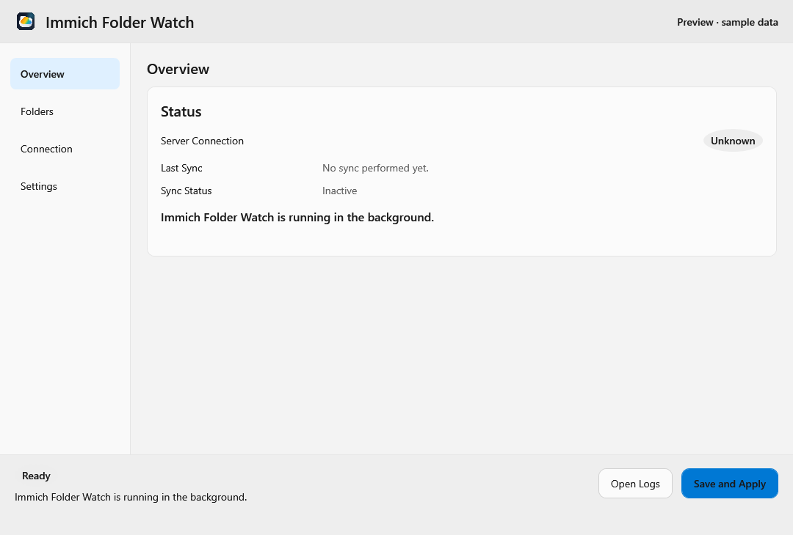
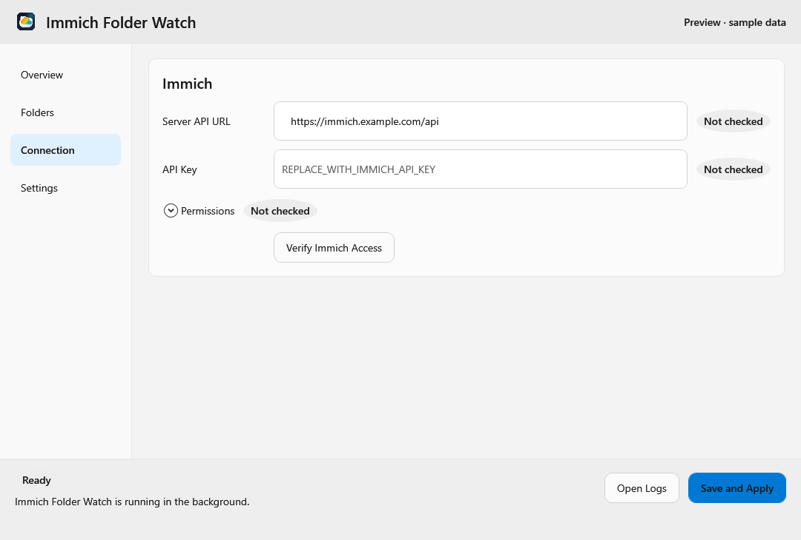
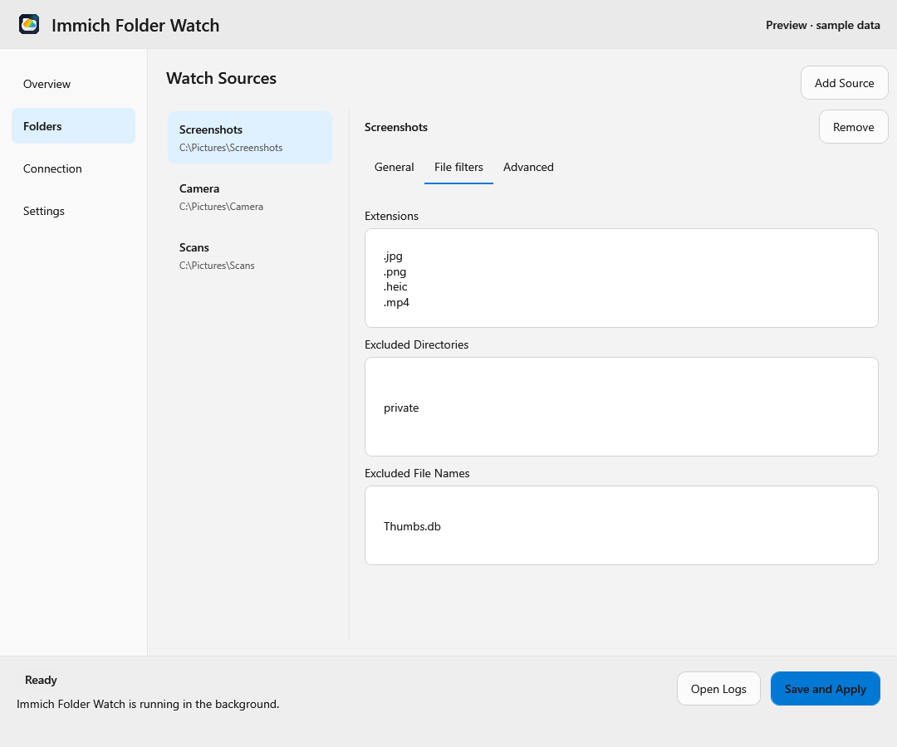
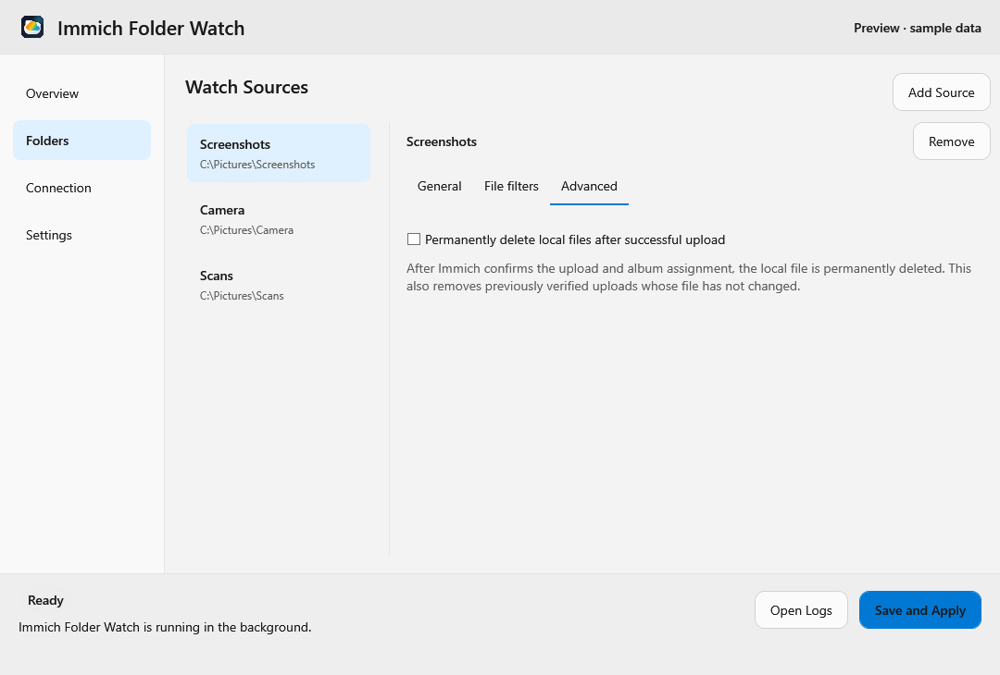
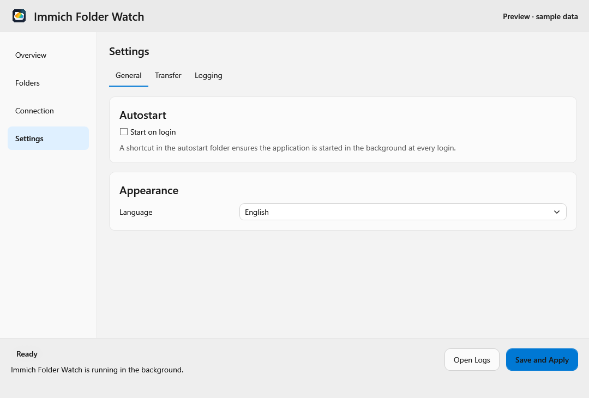
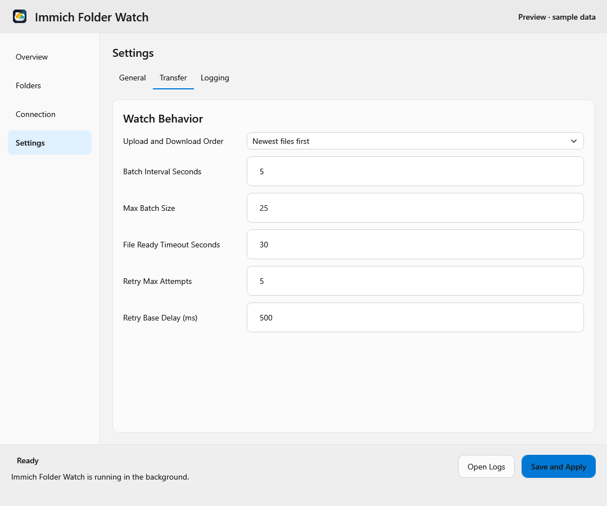
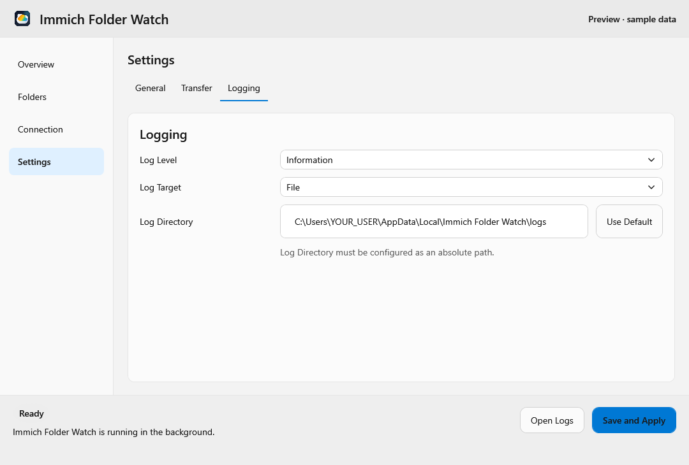

# Desktop interface

Use the sidebar to switch between **Overview**, **Folders**, **Connection**, and
**Settings**. The status and action buttons remain in the footer on every page.
The screenshots below show the Windows interface in English with sample data;
they follow your browser's light or dark preference. Linux has the same pages
and settings, with the platform differences described below.

## First setup

1. In **Connection**, enter your Immich API URL and API key, then select
   **Verify Immich Access**.
2. In **Folders**, select **Add Source**, choose the local source and its sync
   mode, and review the optional album and file filters.
3. In **Settings**, adjust application, transfer, or logging preferences if needed.
4. Select **Save and Apply** to validate the complete configuration, save it,
   and start synchronization with those settings.

## Overview

<picture>
  <source media="(prefers-color-scheme: dark)" srcset="images/ui-overview-dark.png">
  <source media="(prefers-color-scheme: light)" srcset="images/ui-overview-light.png">
  
</picture>

**Server Connection** shows connectivity. **Last Sync** shows the latest
successful upload or download, including previous sessions; an empty scan does
not advance it. See [Last Sync across sessions](configuration.md#last-sync-across-sessions)
for storage and upgrade details. **Sync Status** shows the current transfer,
progress, or most recent sync error. The header contains the application version
and an update link when one is available.

## Connection

<picture>
  <source media="(prefers-color-scheme: dark)" srcset="images/ui-connection-dark.png">
  <source media="(prefers-color-scheme: light)" srcset="images/ui-connection-light.png">
  
</picture>

Enter the **Server API URL**, including `/api`, for example
`https://immich.example.com/api`, and an **API Key** created in Immich. The eye
button reveals or hides the key. **Verify Immich Access** checks the URL, key,
and permissions without saving the draft. Expand **Permissions** to inspect
individual results. Bidirectional sync requires additional permissions, so run
the check again after changing sync modes.

## Folders

Select **Add Source**, then select a folder in the list to edit it. On Windows,
enter its path; on Linux, use the desktop folder picker to grant access.
**Remove** removes the selected source from the draft configuration; it does not
delete local files or Immich assets. Hover over an abbreviated path to read it
in full.

### General

<picture>
  <source media="(prefers-color-scheme: dark)" srcset="images/ui-folders-dark.png">
  <source media="(prefers-color-scheme: light)" srcset="images/ui-folders-light.png">
  
</picture>

Set **Folder Path**, the optional **Immich Album Name**, and **Sync Mode**:

| Sync mode | What it does |
| --- | --- |
| **Upload new files only (default)** | Uploads files that appear while the app is running. Existing files are ignored. |
| **Upload everything in the folder** | Includes existing files at startup and uploads new files added later. No downloads. |
| **Sync folder with album (bidirectional)** | Uploads missing local media to Immich and downloads missing remote media. Local deletions move tracked assets to Immich trash; local moves and album/folder renames also affect synchronization. |

For upload modes, leave the album name empty to upload without album placement,
or enter a name to use an album that the app creates if needed. Enable
**Include subdirectories** to upload from nested folders.

For bidirectional sync, an album name limits synchronization to that album and
the source root; subfolders are ignored. With no album name, the root mirrors
assets outside albums, and first-level subfolders mirror Immich albums. Recursion
is automatic in this mode. Review the [sync and deletion rules](configuration.md#file-selection)
before using it.

### File filters

<picture>
  <source media="(prefers-color-scheme: dark)" srcset="images/ui-filters-dark.png">
  <source media="(prefers-color-scheme: light)" srcset="images/ui-filters-light.png">
  
</picture>

Use one entry per line. **Extensions** selects media types, such as `.jpg` or
`.mp4`; new folders start with the supported media extensions. **Excluded
Directories** matches paths relative to the source, such as `private` or
`**/cache`. **Excluded File Names** matches names, such as `Thumbs.db` or `*.tmp`.
Matching is case-insensitive. Directory exclusions are shown for upload modes
when **Include subdirectories** is enabled. Hidden values remain saved.

### Advanced

<picture>
  <source media="(prefers-color-scheme: dark)" srcset="images/ui-advanced-dark.png">
  <source media="(prefers-color-scheme: light)" srcset="images/ui-advanced-light.png">
  
</picture>

Upload modes offer **Permanently delete local files after successful upload**.
This is off by default. Deletion happens after Immich confirms the upload and
requested album placement, the successful state is saved, and the local file is
still unchanged. Enabling it also removes unchanged, previously verified
uploads. **Deletion bypasses the recycle bin or trash** and leaves the Immich
asset intact. This option is unavailable for bidirectional sync.

## Settings

### General

<picture>
  <source media="(prefers-color-scheme: dark)" srcset="images/ui-settings-dark.png">
  <source media="(prefers-color-scheme: light)" srcset="images/ui-settings-light.png">
  
</picture>

**Start on login** changes operating-system autostart immediately. **Language**
switches immediately between English, German, or the system default; select
**Save and Apply** to keep the preference. The app follows the system's light
or dark theme.

### Transfer

<picture>
  <source media="(prefers-color-scheme: dark)" srcset="images/ui-transfer-dark.png">
  <source media="(prefers-color-scheme: light)" srcset="images/ui-transfer-light.png">
  
</picture>

- **Upload and Download Order** processes newer or older pending files first.
- **Batch Interval Seconds** and **Max Batch Size** control upload batching.
- **File Ready Timeout Seconds** limits how long the app waits for a file to
  become ready for upload.
- **Retry Max Attempts** and **Retry Base Delay (ms)** control retries for
  transient upload failures, such as timeouts or temporary server errors.

These settings apply across folders. Enter positive whole numbers and select
**Save and Apply** to activate changes. See [Configuration](configuration.md#transfer-order-and-status)
for ordering details and defaults.

### Logging

<picture>
  <source media="(prefers-color-scheme: dark)" srcset="images/ui-logging-dark.png">
  <source media="(prefers-color-scheme: light)" srcset="images/ui-logging-light.png">
  
</picture>

**Log Level** controls detail. **Log Target** selects Windows Event Log or files
on Windows, and Journald or files on Linux. For **File**, set an absolute
**Log Directory**, or select **Use Default** to restore the standard location.
**Open Logs** in the footer opens Event Viewer for the Windows Event Log target,
or the file directory for file logging. On Linux it opens the file directory;
use the system journal tools to inspect Journald output.

## Save, troubleshoot, and close

Switching pages, tabs, or folders preserves your draft. **Save and Apply** checks
and saves every folder and global setting, then restarts synchronization.
Navigation alone does not save or pause synchronization.

If saving fails, read the footer message, correct the indicated field, and retry.
For connection problems, check **Connection → Permissions**; for transfer errors,
check **Overview** and **Open Logs**. If Windows reports an unregistered Event Log
source, logging falls back to files; reinstall through the MSI to register it.
For detailed settings and paths, see [Configuration](configuration.md).

Closing the window keeps synchronization running in the background. Windows
provides a tray menu. On Linux, use the launcher to reopen the window and the
footer's **Quit** button to stop the app; tray availability depends on the desktop
and packaging. Linux may request permission to run in the background.

## Compatibility

The sidebar layout introduced in 2.10.0 requires no configuration or sync-state
migration. Selecting pages or folders does not add saved configuration fields.
Existing filter and deletion values are retained when their controls are hidden.
Linux shows the host folder path while preserving the portal grant used for file
access. See [Architecture](architecture.md) for the shared interface model.

## Reproduce the screenshots

The screenshots are offline renders of actual WPF controls, with English sample
data and no server connection. On Windows, run this from the repository root
using the SDK selected by `global.json`:

```powershell
$env:IFW_UI_PREVIEW_DIRECTORY = Join-Path (Get-Location) 'artifacts/ui-preview'
try {
    dotnet test src/ImmichFolderWatch.Tests/ImmichFolderWatch.Tests.csproj -c Debug --filter FullyQualifiedName~MainWindowBindingTests
} finally {
    Remove-Item Env:IFW_UI_PREVIEW_DIRECTORY
}
```

The generator creates `windows-{theme}-{page}.png`, where `theme` is `light` or
`dark` and `page` is `overview`, `folders`, `connection`, `settings`, `filters`,
`advanced`, `transfer`, or `logging`. Review every image before copying it to
`docs/images/ui-{page}-{theme}.png`. Keep screenshots in English and use only
synthetic paths, URLs, and credentials. These previews do not verify native Linux
portal dialogs or a live Immich connection.

<details>
<summary>Historical implementation validation</summary>

### 2.10.0 validation

Validated on Windows with the repository-selected .NET 10 SDK:

```powershell
dotnet restore ImmichFolderWatch.sln
dotnet build ImmichFolderWatch.sln -c Debug -p:UsedAvaloniaProducts=
dotnet test ImmichFolderWatch.sln -c Debug --no-build --no-restore
git diff --check
```

The solution build completed with no warnings or errors; 265 portable tests and
36 Windows tests passed. The empty `UsedAvaloniaProducts` property suppresses
Avalonia's build telemetry task, whose per-user log path is restricted in the
validation environment; it does not change application behavior. Offline WPF
screenshots were inspected in both themes. No new dependencies were added.

Native Linux desktop/portal interaction, Flatpak packaging, and live Immich
integration were not run as part of this UI change. Windows MSI packaging was
subsequently verified as described below. The independent binding
review found no removed configuration, validation, status or action bindings.

### 2.10.1 persistence validation

The solution build passed with no warnings or errors. The full suite passed
281 portable and 36 Windows tests, including previous-session upload/download
restoration, account changes, delete-after-upload, migration, and stale worker
completion. Commands:

```powershell
dotnet build ImmichFolderWatch.sln -c Debug -p:UsedAvaloniaProducts=
dotnet test ImmichFolderWatch.sln -c Debug --artifacts-path artifacts/last-sync-validation -p:UsedAvaloniaProducts= --verbosity minimal
```

The initial run against existing outputs was aborted by a Windows in-page error
in the test host; the complete rerun above used fresh build outputs and passed.
No live Immich server or native Linux portal was used.

### Windows installer validation

Self-contained Windows x64 installers were built for both 2.10.0 and 2.10.1:

```powershell
.\packaging\windows\build-msi.ps1 -Runtime win-x64
```

Both builds succeeded. The MSI Property and Summary Information tables were
opened read-only to verify the product version and `x64;1033` package template.
The published application includes the .NET runtime, and the 2.10.1 payload's
product version identifies commit `8bb5a5d`. Each installer is approximately
52.9 MiB and is generated under `artifacts/windows/msi/`; binaries are not committed.

WiX reports WIX1101 for the existing SQLite native DLL's default language metadata;
there were no installer build errors. Installation/upgrade on a live system and
ARM64 MSI packaging were not exercised for this change.

</details>
