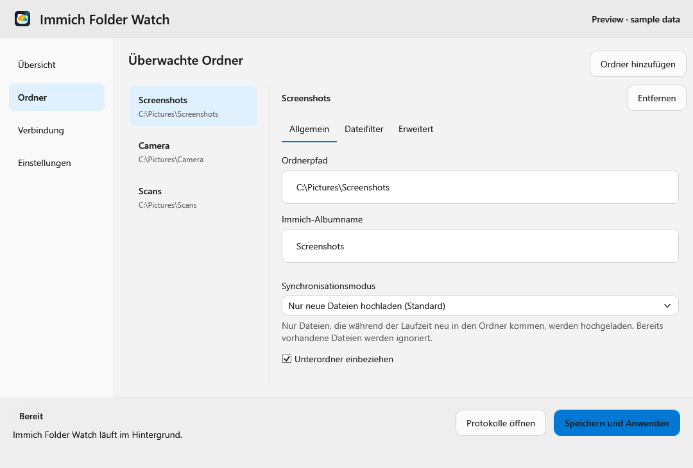
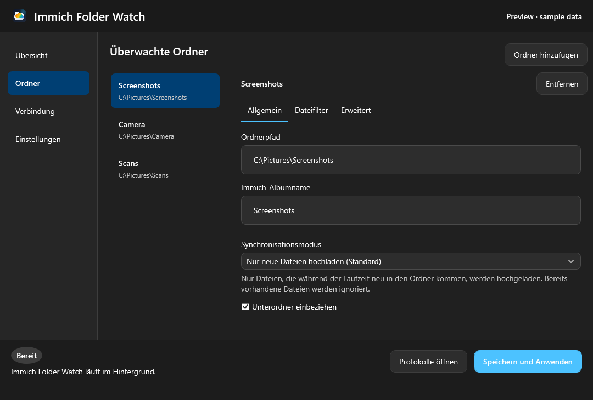

# Desktop interface

Version 2.10.0 replaces the single scrolling configuration form with four sidebar
pages on Windows and Linux. The header, navigation, status and action footer stay
in place; only the selected page or folder list needs scrolling. The folder list
shows a short folder name and its full display path, so equally named folders can
still be distinguished. Long paths are abbreviated in the row and available in full
on hover.



The same layout follows the system theme:



Additional previews: [General settings](images/ui-settings-light.png) and
[Immich connection](images/ui-connection-dark.png). These are offline renders of
the real WPF controls, with synthetic values and no server connection.

## Find an existing control

| Previous location or task | New location |
| --- | --- |
| Server connection, last sync, current transfer and sync errors | **Overview**; the live status also remains in the footer |
| Version and available update link | Header |
| Immich API URL, API key, reveal/hide key, validation results | **Connection** |
| Verify access; aggregate and individual permission results | **Connection**, with expandable **Permissions** |
| Add or remove a watched source | **Folders** |
| Folder path, album, sync mode and its explanation | Select a folder, then **General** |
| Include subdirectories | Folder **General**, for upload modes |
| Included extensions, excluded directories and file names | Folder **File filters** |
| Delete local files after confirmed upload | Folder **Advanced**, for upload modes |
| Autostart and language | **Settings → General** |
| Transfer order, batch interval, batch size, file readiness timeout | **Settings → Transfer** |
| Retry attempt limit and base delay | **Settings → Transfer** |
| Log level, target, file directory and default-directory action | **Settings → Logging** |
| Open Logs; Save and Apply; operation and validation messages | Fixed footer |
| Linux background/tray notice and explicit Quit | Notice above the pages and **Quit** in the footer |

## Set up or edit folders

1. Open **Connection**, enter the server API URL and key, and verify access.
   Expand **Permissions** to inspect individual results.
2. Open **Folders** and add a folder. Linux continues to use the desktop folder
   portal to grant access. Windows retains the editable folder-path field.
3. Select a folder in the list. Set its path, optional album, sync mode and
   recursive upload option under **General**. Use **File filters** for extension
   and exclusion lists. **Advanced** contains deletion after confirmed upload.
4. Open **Settings** to change global transfer, retry, logging or application
   preferences.
5. Select **Save and Apply** in the footer to persist the entire draft and
   restart synchronization with it. Validation and save failures appear in the
   footer even when the affected setting is on another page.

Changing a sidebar page, detail tab or selected folder keeps the edits already
made. Saving includes every source, not only the selected one. Adding selects
the new folder; removing the selected folder selects the next available entry,
or the preceding one at the end of the list. An empty list shows an instruction
to add a folder. Removing a source from the configuration does not delete its
local files or Immich assets.

Autostart retains its existing immediate operating-system effect. Language
changes update the interface immediately; the language preference is included
when saving the configuration. Navigation itself neither saves settings nor
starts or pauses synchronization. Closing/hiding and tray behavior are unchanged.

## Compatibility and upgrade

No YAML or sync-state migration is required for 2.10.0. Existing configuration
keys, defaults, sync modes, filtering and deletion safeguards are unchanged.
The selected page, folder and display name are transient UI state, not new
configuration fields. After applying a configuration, the editor retains the
selected source where possible.

For bidirectional sync, recursion and deletion controls keep their existing
mode-dependent visibility and semantics. Hidden filter and deletion values are
retained. A portal-granted Linux folder displays its host path while retaining
the granted portal path for persistence and transfers; selecting a different
folder does not replace this grant.

Both heads keep English/German live localization and the current platform theme.
Long lists and settings pages scroll independently at smaller window sizes;
keyboard navigation and page tabs remain available. See
[Configuration](configuration.md) for field semantics and
[Architecture](architecture.md) for the shared draft and navigation model.

## Regression checks and screenshots

Portable `NavigationViewModelTests` cover retained source/global configuration,
add/remove/load selection, localization and portal-path identity. Windows
`MainWindowBindingTests` also exercise real WPF bindings, conditional controls,
and layout with 40 sources at the minimum window size. The window remains
unshown and its runtime host stays stopped, avoiding real configuration and HTTP
access.

To regenerate offline WPF previews from the repository root on Windows:

```powershell
$env:IFW_UI_PREVIEW_DIRECTORY = Join-Path (Get-Location) 'artifacts/ui-preview'
dotnet test src/ImmichFolderWatch.Tests/ImmichFolderWatch.Tests.csproj -c Debug --filter FullyQualifiedName~MainWindowBindingTests
Remove-Item Env:IFW_UI_PREVIEW_DIRECTORY
```

Review the generated images before replacing documentation screenshots. A native
Linux desktop smoke check should additionally exercise two portal-granted
folders: edit the first, switch to the second and back, remove the selected
source, and verify that the persisted paths still reference the granted folders.
Windows rendering and portable tests do not exercise native Linux portal dialogs.

### 2.10.0 validation

Validated on Windows with the repository-selected .NET 10 SDK:

```powershell
dotnet restore ImmichFolderWatch.sln
dotnet build ImmichFolderWatch.sln -c Debug -p:UsedAvaloniaProducts=
dotnet test ImmichFolderWatch.sln -c Debug --no-build --no-restore
git diff --check
```

The solution build completed with no warnings or errors; 265 portable tests and
36 Windows tests passed. The empty `UsedAvaloniaProducts` property suppresses
Avalonia's build telemetry task, whose per-user log path is restricted in the
validation environment; it does not change application behavior. Offline WPF
screenshots were inspected in both themes. No new dependencies were added.

Native Linux desktop/portal interaction, MSI/Flatpak packaging, and live Immich
integration were not run as part of this UI change. The independent binding
review found no removed configuration, validation, status or action bindings.
